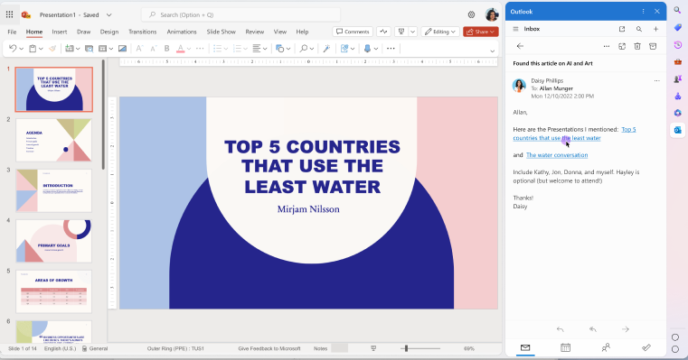

# Side Panel

## Authors:

- [Adolf Daniel](https://github.com/adolfdaniel)
- [Hoch Hochkeppel](https://github.com/mhochk)
- [Min Ren](https://github.com/renmin)
- [Sohum Chatterjee](https://github.com/sohchatt)

## Status of this Document

This document is a starting point for engaging the community and standards
bodies in developing collaborative solutions fit for the Web. As the solutions
to problems described in this document progress along the standards-track, we
will retain this document as an archive and use this section to keep the
community up-to-date with the most current standards venue and content location
of future work and discussions.

- This document status: _Active_
- Expected venue: [W3C Web Applications Working
  Group](https://www.w3.org/2019/webapps/) |
  [w3c/manifest](https://github.com/w3c/manifest/) 
- Current version: this document

## Introduction

Modern browsers have a side panel that can be used to display additional
information about the current page or provides a way to browse side-by-side.
This proposal aims to standardize the side panel and its API. The new side panel
API will allow developers to declare support for the side panel and to control
their web content in the side panel.

## Motivation

The side panel is a new feature in Microsoft Edge that allows the user to view
additional information about the current page or browse side-by-side. The side
panel is a new way for the user to interact with the web. The side panel
currently does not allow developers to control the appearance of their web
content in the side panel. The side panel API will allow developers to control
their web content in the side panel.



## Goals

The goals of the side panel API are:

- To provide a way for developers to allow their web application to be promoted
  as a side-by-side web application.
- To provide a way for developers to control their web application appearance
  on the side panel via Client Hints.

## Non-Goals

The side panel API not intended to be used for:

- Displaying a web application in a side panel that is not of the same origin.

## Use Cases

The side panel API is intended to be used by web applications that want to
provide a side-by-side experience. The browsers can promote the web application
that supports the side panel API as a side-by-side web application. The browser
can also provide a way for the user to pin the web application to the side panel
so that the user can easily access the web application as a side-by-side web
application.

## Proposed Solution

The developer can declare support for the side panel by adding a
`edge_side_panel` (or `side_panel` when standardized) property to the web
app manifest. The value of the property is an object indicating whether the web
application supports the side panel. The developer can also specify the minimum
width they want their web application to be displayed in the side panel. The
preferred width is specified in CSS pixels on the web app manifest using the
`preferred_width` property of the `edge_side_panel` object.

```json
{
  "name": "Side Panel Web App",
  "short_name": "Side Panel",
  "icons": [
    {
      "src": "icon/lowres.png",
      "sizes": "64x64",
      "type": "image/png"
    },
    {
      "src": "icon/hd_hi.png",
      "sizes": "128x128 256x256",
      "type": "image/png"
    }
  ],
  "start_url": "/",
  "display": "standalone",
  "edge_side_panel": {
    "preferred_width": 600
  }
}
```

The developer can also control the appearance of their web application in the
side panel by using Client Hints. The developer can use the `Sec-CH-UA` header
or `navigator.userAgentData.brands` to detect if the web application is being
displayed in the side panel.

    ```javascript
    if (navigator.userAgentData.brands.some(brand => brand.brand === 'Edge Side Panel')) {
      // The web application is being displayed in the side panel.
    }
    ```

## Alternatives Considered

The side panel API can be implemented as a new display mode. However, the
`display_mode` property is an existing property in the web app manifest and it
could break existing web applications on unsupported browsers. The side panel
API is implemented as a new property in the web app manifest to avoid breaking
existing web applications.

## Security and Privacy Considerations

The side panel API does not introduce any new security or privacy
considerations.
